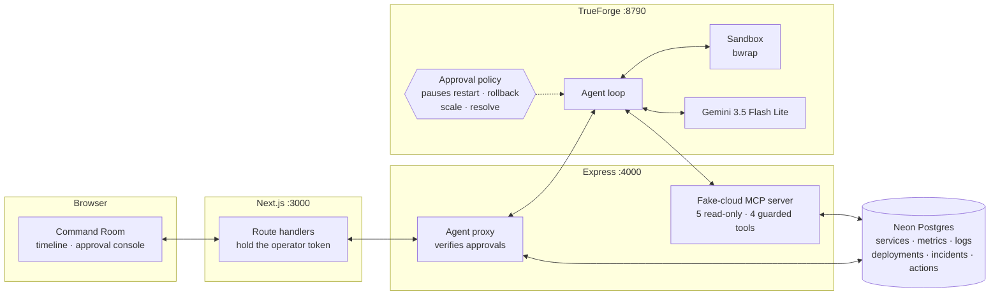
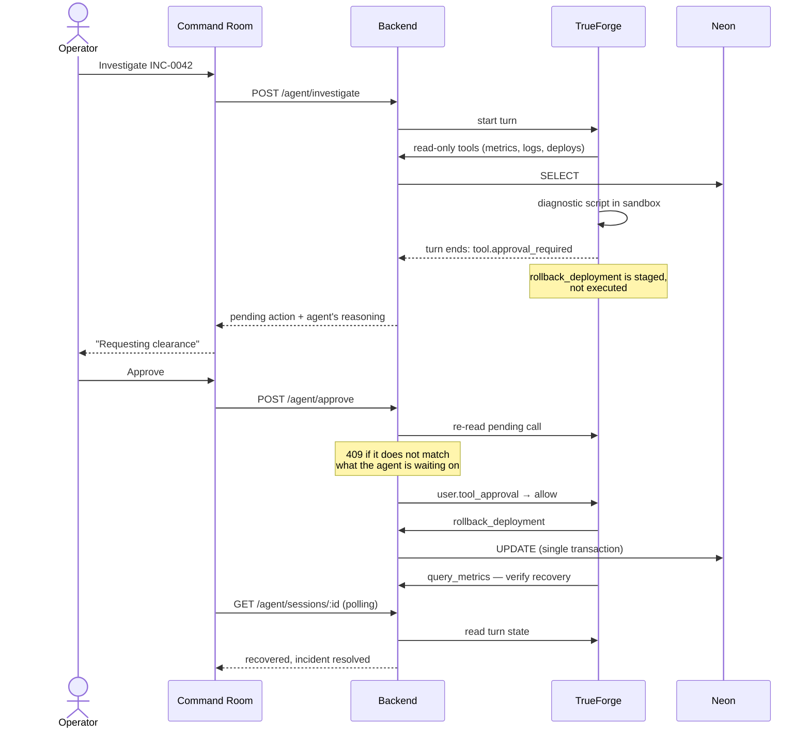

# Mayday

**Mayday answers your alerts: it diagnoses in a sandbox and fixes only with your approval.**

An approval-gated incident responder built on [TrueForge](https://trueforge.dev) for the
[Agent Harness Hackathon](https://www.wemakedevs.org/hackathons/trueforge).

When an alert fires, the agent pulls metrics, logs and deploy history through read-only MCP
tools, writes its own diagnostic scripts and runs them in an isolated sandbox, then proposes a
remediation — restart, rollback, or scale. It stops there. Nothing that changes the system runs
until a person clears it in the Command Room.

The point is the pause. An agent that can restart your checkout service at 3am is only useful if
you can see exactly what it intends to do, and why, before it does it.

---

## What a run looks like

A real investigation, end to end, takes three turns and two approvals:

| | The agent | The operator |
|---|---|---|
| **1. Investigate** | Reads the incident, 45 minutes of telemetry, error logs and deploy history. Runs a Python script in the sandbox to correlate the degradation against recent deploys. Proposes `rollback_deployment`. | Sees the evidence and the proposed action. **Approves.** |
| **2. Verify** | Executes the rollback, re-queries telemetry, confirms latency and error rate are recovering. Proposes `resolve_incident`. | Confirms recovery. **Approves.** |
| **3. Report** | Summarises root cause, timeline and what was changed. | Done. |

From an actual run against the seeded scenario:

> Degradation began at 18:51, matching the deploy of **v1.4.2** at 18:51:24
> (*"checkout: rework DB connection pooling for lower latency"*). Before the deploy, p95 latency
> was ~140ms with 0.3% errors. After: **2,383ms** (17× baseline), CPU 96%, errors 8.1%. Logs show
> repeated `timeout acquiring connection from pool (5000ms exceeded)`.

After the approved rollback: `checkout-api` healthy on v1.4.1, **p95 217ms, errors 0.2%**.

---

## Architecture



The browser never talks to the backend directly. It calls this app's own route handlers, which
run server-side and attach `OPERATOR_TOKEN`, so the credential that can clear a rollback is never
shipped to a client bundle.

### The approval gate, in sequence



---

## The simulated cloud

There is no real infrastructure. `backend/` seeds a Neon Postgres database with five services, two
hours of per-minute telemetry, deploy history and log lines — including one scripted failure:
`checkout-api v1.4.2` leaks database connections, so every demo starts with a live SEV-1 that has a
discoverable root cause.

Nine MCP tools sit on top:

| Read-only — run freely | Guarded — require approval |
|---|---|
| `get_service_health` | `restart_service` |
| `query_metrics` | `rollback_deployment` |
| `search_logs` | `scale_service` |
| `list_deployments` | `resolve_incident` |
| `get_incident` | |

Guarded tools are annotated `destructive` and listed in `require_approval_for_tools`, so TrueForge
pauses the turn before any of them execute. They also run in a single transaction, validate that
the target exists, and refuse to roll back to a version that was never deployed.

When no version is given, `rollback_deployment` picks the newest release that has not itself been
rolled back, so backing out twice cannot reinstate the release you just backed out of. A version
named explicitly is honoured as given — that is a deliberate instruction from someone who has
already approved it.

---

## Running it

### The short way: one click

[](https://codespaces.new/Anamiiikka/Mayday)

A codespace builds the whole stack — sandbox dependencies, a database, the harness, and the
Command Room — and starts it for you. Paste a [Google AI Studio](https://aistudio.google.com/apikey)
key into the `GEMINI_API_KEY` secret when you create it; leave `NEON_DATABASE_URL` blank and a
local Postgres is used instead. When the build finishes, open port 3000 from the Ports tab.

This is not a convenience shortcut around a hard setup — it is the only environment we can promise
in advance. TrueForge's sandbox builds a bubblewrap jail, which needs a user namespace, and the
default container seccomp profile denies that syscall; the devcontainer asks for `privileged` so
the codespace can create one. Most managed container platforms will not let you make that request
at all, which is why there is no Render or Vercel button here for the harness.

Everything below is the same stack, assembled by hand.

### You will need

Node 22+, a [Neon](https://neon.tech) database (free tier), a
[Google AI Studio](https://aistudio.google.com/apikey) key (free tier), and a Linux host for the
harness — on Windows that means WSL2, because TrueForge's sandbox is Linux-only.

### 1. The simulated cloud

```bash
cd backend
cp .env.example .env          # add NEON_DATABASE_URL
openssl rand -hex 24          # put the result in OPERATOR_TOKEN
npm install && npm run seed   # creates the schema and the SEV-1
npm run dev                   # :4000
```

The seed writes telemetry relative to *now*, so a database left overnight will have no data in the
window the agent looks at. Re-run `npm run seed` (or `POST /api/demo/reset` with the operator
token) before a demo.

### 2. The harness

TrueForge needs Linux. On Windows, run it inside WSL:

```bash
sudo bash scripts/setup-sandbox-host.sh  # sandbox deps + offline pip wheels
SERVER_EXECUTION_TIMEOUT_SECONDS=1800 npx @truefoundry/trueforge
```

Read the header of that script before running it: the sandbox's `pip` cannot see environment
variables, so making offline installs work requires a host-wide pip config. The script backs up
whatever was there and `--revert` restores it, but use a WSL instance you are happy to dedicate
to this.

Add `networkingMode=mirrored` under `[wsl2]` in `%USERPROFILE%\.wslconfig` so WSL and Windows
share `localhost`; without it the harness cannot reach the backend.

### 3. Model, tools, agent

```bash
# a model provider — free tiers differ wildly, see below
curl -X PUT http://localhost:8790/api/v1/settings/model-providers \
  -H 'Content-Type: application/json' \
  -d '{"manifest":{"type":"google-gemini","auth":{"api_key":"YOUR_KEY"},
       "models":[{"model_id":"gemini-3.5-flash-lite","name":"gemini-3-5-flash-lite",
       "properties":{"context_length":1048576,"max_output_tokens":65536}}]}}'

# the fake cloud — the bearer token must match MCP_TOKEN in backend/.env, or
# anything that can reach port 4000 could invoke a destructive tool directly
curl -X PUT http://localhost:8790/api/v1/settings/mcp-servers \
  -H 'Content-Type: application/json' \
  -d '{"manifest":{"type":"remote","name":"mayday-fake-cloud","url":"http://localhost:4000/mcp",
       "description":"Mayday simulated cloud: read-only telemetry and approval-gated actions.",
       "auth":{"type":"header","headers":{"Authorization":"Bearer YOUR_MCP_TOKEN"}}}}'

# the agent
curl -X POST http://localhost:8790/api/v1/agents \
  -H 'Content-Type: application/json' --data-binary @trueforge/agent.json
```

### 4. The Command Room

```bash
cd frontend
cp .env.example .env.local    # same OPERATOR_TOKEN as the backend
npm install && npm run dev    # :3000
```

Open <http://localhost:3000>, scroll to the Command Room, and investigate INC-0042.

---

## Choosing a model

The agent makes 10–20 model calls per investigation, so **per-minute request caps matter more than
price**. Free tiers vary more than you would expect:

| Provider | Verdict |
|---|---|
| **Google Gemini** `gemini-3.5-flash-lite` | **Recommended.** Reliable tool calling, enough headroom to finish a run. What `trueforge/agent.json` ships with. |
| Groq | Caps at 8,000 tokens/min — about two calls. The harness's first request alone is larger than that, so the run dies immediately. |
| NVIDIA NIM | `llama-3.3-70b` and `deepseek-v4-flash` work but take 30–40s per call. `gpt-oss-120b` hangs once tool-call history builds up. |

TrueForge does not retry on 429, so a single rate-limit ends the turn. If a run stalls, that is
usually why.

---

## Repository

```
backend/     Express: fake-cloud MCP server, Neon access, TrueForge proxy
frontend/    Next.js: landing page, Command Room, approval console
trueforge/   agent.json — instructions, gated tools, sandbox config
scripts/     WSL sandbox setup
```

No secrets are committed. Everything sensitive lives in `.env` files that are gitignored; the
`.env.example` files list what you need to supply.

---

## Safety model

- **Investigation cannot change anything.** The tools the agent reaches for on its own are
  read-only; the ones that mutate state are gated by the harness.
- **Approvals are bound to a specific call.** The backend re-reads what the agent is actually
  waiting on and answers `409` if the decision does not match, so a stale tab cannot clear an
  action other than the one it displayed.
- **The token never reaches the browser.** Agent, approval and reseed routes require
  `OPERATOR_TOKEN`, attached server-side. The backend refuses those routes outright when it is
  unset — an approval gate anything on the network can satisfy is not a gate.
- **Mutations are atomic.** Each guarded tool commits its state change, telemetry and audit row in
  one transaction, so a partial failure leaves nothing half-applied.
- **Everything is audited.** Every approved action is written to `actions` with its reason and
  outcome, and shown in the incident's history — including ones that were cleared and then refused
  by validation, which are recorded as `refused: <why>` rather than vanishing.
