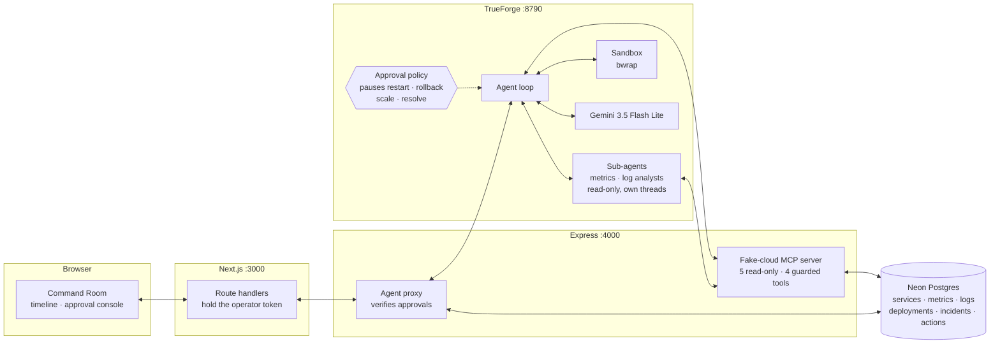
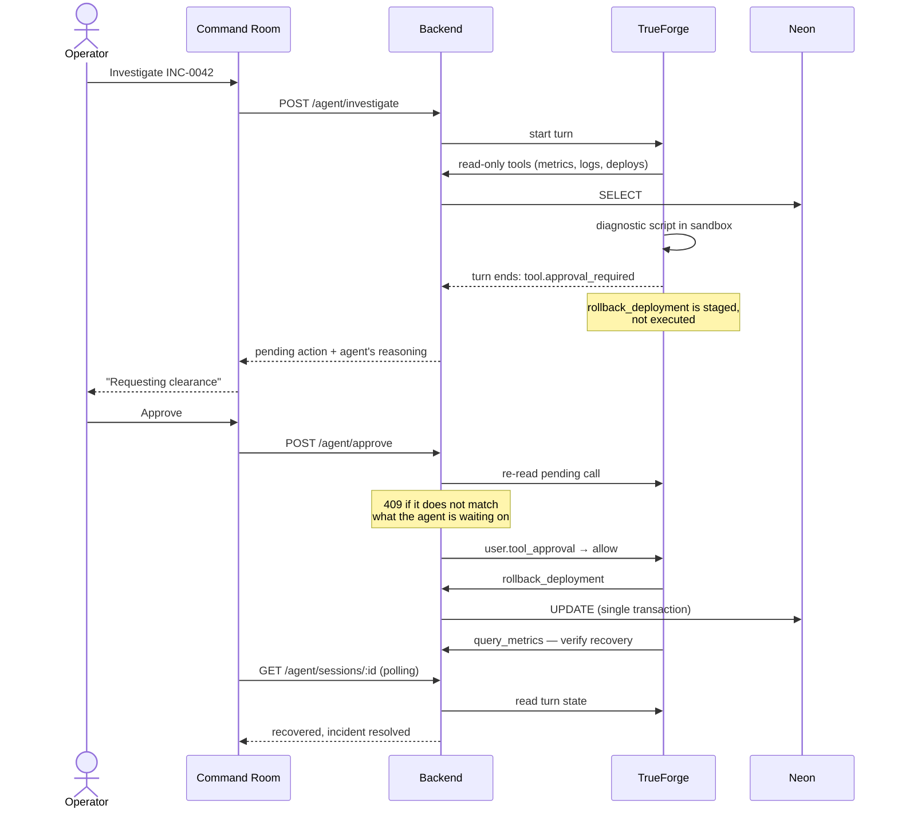

# Mayday

**Mayday answers your alerts: it diagnoses in a sandbox and fixes only with your approval.**

An approval-gated incident responder built on [TrueForge](https://trueforge.dev) for the
[Agent Harness Hackathon](https://www.wemakedevs.org/hackathons/trueforge).

When an alert fires, the agent pulls metrics, logs and deploy history through read-only MCP
tools, writes its own diagnostic scripts and runs them in an isolated sandbox, then proposes a
remediation — restart, rollback, or scale. It stops there. Nothing that changes the system runs
until a person clears it in the Command Room.

The point is the pause. An agent that can restart your checkout service at 3am is only useful if
you can see exactly what it intends to do, and why, before it does it.

---

## Contents

- [What a run looks like](#what-a-run-looks-like)
- [Where the harness carries the weight](#where-the-harness-carries-the-weight)
- [Architecture](#architecture)
- [The simulated cloud](#the-simulated-cloud)
- [Running it](#running-it)
- [Choosing a model](#choosing-a-model)
- [Repository](#repository)
- [Safety model](#safety-model)
- [Design decisions](#design-decisions)
- [How this is known to work](#how-this-is-known-to-work)
- [Qodo code review evidence](#qodo-code-review-evidence)
- [Known limitations](#known-limitations)
- [Status](#status)

---

## What a run looks like

A real investigation, end to end, takes three turns and two approvals:

| | The agent | The operator |
|---|---|---|
| **1. Investigate** | Reads the incident, then delegates to two read-only sub-agents — a metrics analyst and a log analyst, each on its own thread. Correlates their findings against deploy history, and runs a Python script in the sandbox to produce a structured diagnosis. Proposes `rollback_deployment`. | Sees the evidence and the proposed action. **Approves.** |
| **2. Verify** | Executes the rollback, re-queries telemetry, confirms latency and error rate are recovering. Proposes `resolve_incident`. | Confirms recovery. **Approves.** |
| **3. Report** | Summarises root cause, timeline and what was changed. | Done. |

From an actual run against the seeded scenario:

> Degradation began at 18:51, matching the deploy of **v1.4.2** at 18:51:24
> (*"checkout: rework DB connection pooling for lower latency"*). Before the deploy, p95 latency
> was ~140ms with 0.3% errors. After: **2,383ms** (17× baseline), CPU 96%, errors 8.1%. Logs show
> repeated `timeout acquiring connection from pool (5000ms exceeded)`.

After the approved rollback: `checkout-api` healthy on v1.4.1, **p95 217ms, errors 0.2%**.

---

## Where the harness carries the weight

Mayday is not an LLM with a dashboard bolted on. Each of its defining behaviours is a harness
primitive, and removing the harness removes the behaviour:

| What Mayday needs | The TrueForge primitive that provides it |
|---|---|
| Tools that read and change a live system | A remote MCP server, registered once and reached over streamable HTTP with a bearer token |
| A hard stop before anything destructive | `require_approval_for_tools` — the turn ends `done` carrying `tool.approval_required`, and only a `user.tool_approval` input resumes it |
| Evidence gathered by more than one agent | `dynamic_sub_agents` — the agent delegates a metrics analyst and a log analyst with `create_sub_agent`, each on its own thread |
| Analysis the agent writes for itself | The local sandbox: a bubblewrap jail with a fresh Python interpreter, no package access and no route to the network |
| A record an operator can audit afterwards | The session event log — every call, argument and result, replayed into the timeline |
| Surviving a reload mid-incident | Session and turn state held by the harness, not in browser memory |

The pause in the middle of a Mayday run is the harness's pause. We do not implement it, intercept
it, or simulate it — we render it and hand the decision to a person.

---

## Architecture



The browser never talks to the backend directly. It calls this app's own route handlers, which
run server-side and attach `OPERATOR_TOKEN`, so the credential that can clear a rollback is never
shipped to a client bundle.

### The approval gate, in sequence



---

## The simulated cloud

There is no real infrastructure. `backend/` seeds a Neon Postgres database with five services, two
hours of per-minute telemetry, deploy history and log lines — and two scripted failures, chosen to
fail in different ways so the right fix is different too:

| | `INC-0042` · SEV-1 | `INC-0043` · SEV-2 |
|---|---|---|
| Service | `checkout-api` | `payments-worker` |
| Shape | A step change at 15:00 — p95 140 ms → 2,400 ms, errors 0.3% → 8.1% | A drift over 90 minutes — p95 140 ms → 610 ms, CPU 45% → 92% |
| Errors | 8.1% | **0.6%. Requests are slow, not failing** |
| Logs | `timeout acquiring connection from pool` | `heap usage 94% of limit, GC pause 1,240ms` |
| Deploy history | `v1.4.2` shipped three minutes before it broke | Nothing released in 26 hours |
| Right answer | `rollback_deployment` | `restart_service` |

The second one exists to make the diagnosis falsifiable. An agent that pattern-matches "incident →
roll back" gets it wrong, and the evidence that says so — a flat error rate and an empty deploy
window — is exactly what the SOP tells it to look for.

Nine MCP tools sit on top:

| Read-only — run freely | Guarded — require approval |
|---|---|
| `get_service_health` | `restart_service` |
| `query_metrics` | `rollback_deployment` |
| `search_logs` | `scale_service` |
| `list_deployments` | `resolve_incident` |
| `get_incident` | |

Guarded tools are annotated `destructive` and listed in `require_approval_for_tools`, so TrueForge
pauses the turn before any of them execute. They also run in a single transaction, validate that
the target exists, and refuse to roll back to a version that was never deployed.

When no version is given, `rollback_deployment` picks the newest release that has not itself been
rolled back, so backing out twice cannot reinstate the release you just backed out of. A version
named explicitly is honoured as given — that is a deliberate instruction from someone who has
already approved it.

---

## Running it

### The short way: one click

[](https://codespaces.new/Anamiiikka/Mayday)

A codespace builds the whole stack — sandbox dependencies, a database, the harness, and the
Command Room — and starts it for you. Paste an [OpenRouter](https://openrouter.ai/keys)
key into the `OPENROUTER_API_KEY` secret when you create it (a `GEMINI_API_KEY` secret is kept as a
fallback); leave `NEON_DATABASE_URL` blank and a local Postgres is used instead. When the build
finishes, open port 3000 from the Ports tab.

This is not a convenience shortcut around a hard setup — it is the only environment we can promise
in advance. TrueForge's sandbox builds a bubblewrap jail, which needs a user namespace, and the
default container seccomp profile denies that syscall; the devcontainer asks for `privileged` so
the codespace can create one. Most managed container platforms will not let you make that request
at all, which is why there is no Render or Vercel button here for the harness.

Everything below is the same stack, assembled by hand.

### You will need

Node 22+, a [Neon](https://neon.tech) database (free tier), an
[OpenRouter](https://openrouter.ai/keys) key (free tier; Gemini via
[Google AI Studio](https://aistudio.google.com/apikey) as fallback), and a Linux host for the
harness — on Windows that means WSL2, because TrueForge's sandbox is Linux-only.

### 1. The simulated cloud

```bash
cd backend
cp .env.example .env          # add NEON_DATABASE_URL
openssl rand -hex 24          # put the result in OPERATOR_TOKEN
npm install && npm run seed   # creates the schema and the SEV-1
npm run dev                   # :4000
```

The seed writes telemetry relative to *now*, so a database left overnight will have no data in the
window the agent looks at. Re-run `npm run seed` (or `POST /api/demo/reset` with the operator
token) before a demo.

### 2. The harness

TrueForge needs Linux. On Windows, run it inside WSL:

```bash
sudo bash scripts/setup-sandbox-host.sh  # sandbox deps + offline pip wheels
SERVER_EXECUTION_TIMEOUT_SECONDS=1800 npx @truefoundry/trueforge
```

Read the header of that script before running it: the sandbox's `pip` cannot see environment
variables, so making offline installs work requires a host-wide pip config. The script backs up
whatever was there and `--revert` restores it, but use a WSL instance you are happy to dedicate
to this.

Add `networkingMode=mirrored` under `[wsl2]` in `%USERPROFILE%\.wslconfig` so WSL and Windows
share `localhost`; without it the harness cannot reach the backend.

### 3. Model, tools, agent

```bash
# a model provider — OpenRouter is the default (Gemini stays as a fallback), see below
curl -X PUT http://localhost:8790/api/v1/settings/model-providers \
  -H 'Content-Type: application/json' \
  -d '{"manifest":{"type":"custom","name":"openrouter","base_url":"https://openrouter.ai/api/v1",
       "auth":{"api_key":"YOUR_KEY"},
       "models":[{"name":"openrouter-minimax-m3","model_id":"minimax/minimax-m3:free","properties":{}}]}}'

# fallback provider — only needed if you prefer Gemini
curl -X PUT http://localhost:8790/api/v1/settings/model-providers \
  -H 'Content-Type: application/json' \
  -d '{"manifest":{"type":"google-gemini","auth":{"api_key":"YOUR_KEY"},
       "models":[{"model_id":"gemini-3.5-flash-lite","name":"gemini-3-5-flash-lite",
       "properties":{"context_length":1048576,"max_output_tokens":65536}}]}}'

# the fake cloud — the bearer token must match MCP_TOKEN in backend/.env, or
# anything that can reach port 4000 could invoke a destructive tool directly
curl -X PUT http://localhost:8790/api/v1/settings/mcp-servers \
  -H 'Content-Type: application/json' \
  -d '{"manifest":{"type":"remote","name":"mayday-fake-cloud","url":"http://localhost:4000/mcp",
       "description":"Mayday simulated cloud: read-only telemetry and approval-gated actions.",
       "auth":{"type":"header","headers":{"Authorization":"Bearer YOUR_MCP_TOKEN"}}}}'

# the agent
curl -X POST http://localhost:8790/api/v1/agents \
  -H 'Content-Type: application/json' --data-binary @trueforge/agent.json
```

### 4. The Command Room

```bash
cd frontend
cp .env.example .env.local    # same OPERATOR_TOKEN as the backend
npm install && npm run dev    # :3000
```

Open <http://localhost:3000>, scroll to the Command Room, and investigate INC-0042.

---

## Choosing a model

The agent makes 10–20 model calls per investigation, so **per-minute request caps matter more than
price**. Free tiers vary more than you would expect:

| Provider | Verdict |
|---|---|
| **OpenRouter** `openrouter-minimax-m3` | **Recommended / default.** What `trueforge/agent.json` ships with. Reliable tool calling; the `:free` route shares a per-provider pool, so when it is busy you can switch to a fallback. |
| **Google Gemini** `gemini-3.5-flash-lite` | **Fallback.** Reliable tool calling and enough headroom to finish a run. Registered alongside OpenRouter unless you want it as the only provider; switch the model name in `trueforge/agent.json` to use it as primary. |
| Groq | Caps at 8,000 tokens/min — about two calls. The harness's first request alone is larger than that, so the run dies immediately. |
| NVIDIA NIM | `llama-3.3-70b` and `deepseek-v4-flash` work but take 30–40s per call. `gpt-oss-120b` hangs once tool-call history builds up. |

TrueForge does not retry on 429, so a single rate-limit ends the turn. If a run stalls, that is
usually why.

Delegation makes this sharper, because a sub-agent is a whole agent loop with its own model calls.
The first fan-out run ended on a 429 with the analysts burning three sandbox executions apiece —
the harness tells sub-agents to prefer sandbox code for mechanical work, which is good advice
against a generous quota and fatal against fifteen requests a minute. The briefs now say one direct
tool call each and no code, which is also the honest description of the work: fetch one thing,
summarise it.

---

## Repository

```
backend/          Express: fake-cloud MCP server, Neon access, TrueForge proxy
  src/rollback.ts     which release a rollback falls back to — pure, tested
  src/*.test.ts       node:test suites, colocated with what they cover
frontend/         Next.js: landing page, Command Room, approval console
trueforge/        agent.json — SOP, sub-agent fan-out, gated tools, sandbox
scripts/          sandbox host setup (bubblewrap deps, offline pip wheels)
.devcontainer/    one-click Codespaces environment
.github/workflows/  CI: lint, typecheck, tests, builds
```

No secrets are committed. Everything sensitive lives in `.env` files that are gitignored; the
`.env.example` files list what you need to supply.

---

## Safety model

- **Investigation cannot change anything.** The tools the agent reaches for on its own are
  read-only; the ones that mutate state are gated by the harness.
- **Delegation does not widen what the agent can do.** Sub-agents are briefed to gather evidence
  read-only, and the gate does not depend on their obedience: `require_approval_for_tools` is
  enforced per tool by the harness, so a sub-agent that reached for `rollback_deployment` would
  pause for the same human approval its parent would.
- **Approvals are bound to a specific call.** The backend re-reads what the agent is actually
  waiting on and answers `409` if the decision does not match, so a stale tab cannot clear an
  action other than the one it displayed.
- **The token never reaches the browser.** Agent, approval and reseed routes require
  `OPERATOR_TOKEN`, attached server-side. The backend refuses those routes outright when it is
  unset — an approval gate anything on the network can satisfy is not a gate.
- **Mutations are atomic.** Each guarded tool commits its state change, telemetry and audit row in
  one transaction, so a partial failure leaves nothing half-applied.
- **Everything is audited.** Every approved action is written to `actions` with its reason and
  outcome, and shown in the incident's history — including ones that were cleared and then refused
  by validation, which are recorded as `refused: <why>` rather than vanishing.

---

## Design decisions

- **The simulated cloud is a real database, not a stub.** Five services, two hours of per-minute
  telemetry and a deploy history live in Postgres, so the agent has to *find* the root cause rather
  than be handed it. It also means the guarded tools do genuine transactional work.
- **Read tools return summaries, not rows.** `query_metrics` buckets and aggregates rather than
  returning 120 samples. Raw telemetry filled the context window and left the model less room to
  reason, not more.
- **The approval gate is the harness's, not ours.** We could have gated writes in the Express
  layer. Doing it in `require_approval_for_tools` means the agent loop itself is suspended — there
  is no code path where the tool runs and we decline to show it.
- **The operator token never reaches the browser.** It lives in a `server-only` module; the
  Command Room's route handlers attach it. The backend refuses the agent routes outright when it is
  unset, because a gate anything on the network can satisfy is not a gate.
- **`/mcp` requires its own bearer token.** The approval gate lives in the harness, so an
  unauthenticated MCP endpoint would let anything that could reach the port call
  `rollback_deployment` directly and walk straight around it.
- **Telemetry is seeded relative to `now()`.** A fixed timestamp would mean an empty chart the next
  morning, so every start reseeds and the demo incident is always fifteen minutes old.
- **Rollback defaults to the newest release that has not itself been rolled back**, so backing out
  twice cannot reinstate the release you just backed out of. An explicitly named version is honoured
  as given — that is a deliberate instruction from someone who already approved it.
- **Actions that are approved and then refused by validation are still audited**, recorded as
  `refused: <why>` rather than vanishing. An approval that produced nothing is exactly the thing an
  operator needs to see afterwards.
- **One scenario, finished.** A second incident type was scoped and dropped in favour of making the
  checkout rollback work end to end, including recovery telemetry the agent can actually read back.
- **Evidence gathering fans out; remediation does not.** Metrics and logs are independent lines of
  evidence, so two sub-agents collect them in parallel and the parent correlates. Everything after
  that — the diagnosis, the proposal, the mutation — stays on one thread, because an approval
  should be for one action taken by one actor.
- **Tests start at the approval gate, not at the edges.** The two functions that decide whether the
  gate holds were lifted out of the code that talks to Postgres and the harness so they could be
  tested directly. Both had real bugs found in review; both now have the regression pinned.
- **The model was chosen on rate limits, not benchmarks.** An investigation is 10–20 calls; see
  [Choosing a model](#choosing-a-model).
- **The codespace is the deployment.** The sandbox needs a container that may create user
  namespaces, which managed platforms deny, so the repo ships the environment instead of a URL.

---

## How this is known to work

Two things run before anything merges: the checks on every pull request, and the tests that pin
down the logic the approval gate depends on. What someone else caught is
[its own section](#qodo-code-review-evidence).

### On every pull request

| Job | What it does |
|---|---|
| `frontend` | `eslint` and a production `next build` |
| `backend` | `tsc --noEmit` over source *and* tests, `npm test`, then a build |

### What the tests pin down

The unit tests (`node:test`, no framework) cover the two pieces of logic that decide whether the
approval gate holds — both of which had real bugs caught in review:

- **`chooseRollbackTarget`** — the one piece of judgement in an otherwise mechanical tool, and it
  runs *after* a human has approved the action. Tested for the double-rollback case (backing out
  twice must not reinstate the release just backed out of), unknown versions, no history, a target
  already running, and an explicitly named version being honoured as given.
- **`resolvePending`** — what the operator is actually being asked to clear. Tested for a resumed
  turn no longer showing its old pause, and for naming the tool correctly when Code Mode kept the
  call off the timeline. That second case is the "Mayday wants to run *unknown*" regression.

Alongside those, `buildTimeline` is tested for pairing calls with responses, classifying tools by
how much trust they need, hiding harness bookkeeping, unwrapping `call_tool`, flagging refusals,
and putting sub-agent work in its own lane.

```bash
cd backend && npm test     # 20 tests, no database required
```

The database-backed tool paths themselves are covered by the end-to-end run rather than by unit
tests — see [known limitations](#known-limitations).

---

## Qodo code review evidence

Every change went through a pull request reviewed by [Qodo](https://qodo.ai) before merging, per the
hackathon's code-review requirement. **Twenty-three findings across seven pull requests**, all fixed
before merge except one dismissed on purpose. The fix commits are in the history under `Address review:`.

| PR | Found | What review caught |
|---|---|---|
| [#2](https://github.com/Anamiiikka/Mayday/pull/2) | 1 | Static font weights loaded where a variable axis was intended |
| [#3](https://github.com/Anamiiikka/Mayday/pull/3) | 1 | Folding the dashboard into the landing page deleted `/command-room` outright, 404-ing every existing link. Now redirects to the embedded section |
| [#4](https://github.com/Anamiiikka/Mayday/pull/4) | 8 | The heaviest round, and all of it in the tools: mutations and the seed were non-atomic, so a late failure left the fake cloud half-changed; `restart_service` and `resolve_incident` reported success for services and incidents that did not exist; `rollback_deployment` accepted any version string and activated it unchecked; audit rows attached to the wrong incident; `/mcp` was reachable without auth |
| [#5](https://github.com/Anamiiikka/Mayday/pull/5) | 2 | Telemetry was ordered by a *formatted clock string*, so buckets and log ranges crossing midnight came back reversed and undated. The agent would have read the sequence backwards and diagnosed from it |
| [#6](https://github.com/Anamiiikka/Mayday/pull/6) | 5 | Two rounds. Rollback could reinstate the release just backed out of; the agent, approval and reset routes were callable with no token at all; a backend outage rendered as a permanent 404 instead of something retryable; approval state was never written back, so the incident feed showed "Investigating" while a decision sat waiting |
| [#7](https://github.com/Anamiiikka/Mayday/pull/7) | 3 | Three places this README and the code disagreed — including approved-then-refused actions leaving no audit trail at all, because guarded handlers returned before recording anything |
| [#8](https://github.com/Anamiiikka/Mayday/pull/8) | 3 | The codespace generated an empty `MCP_TOKEN`, leaving `/mcp` unauthenticated and the approval gate bypassable by anything that could reach the port. A second round caught two more: reading a token out of an older `.env` aborted the whole build under `set -e` when the line was not there, and registering the agent with `POST` meant an agent from an earlier run silently kept its old SOP — every later edit ignored, with nothing to show for it |

Four of these were ways past the approval gate — #4's unauthenticated `/mcp`, #6's untokened
approval route and its rollback target, and #8's empty token — and none of them were visible from
the UI. #8's second round is the other kind worth having: two silent failures, one that would have
stopped a judge's codespace building and one that would have let it build and then run the wrong
agent.

#7 is worth reading for a different reason: review compared this file against the code and found
the code wanting, which is how the `refuse()` path that audits cleared-but-rejected actions came to
exist.

One finding was **dismissed rather than fixed**: #6 flagged that the sandbox setup script points
`pip` at staged wheels host-wide. That is true, and it is the only way the sandboxed `pip` can
resolve anything, because it does not inherit environment variables. The script backs up whatever
config was there, `--revert` restores it, and the header says so before you run it.

---

## Known limitations

Stated plainly, because a hackathon judge will find them anyway.

- **The tests stop at the database.** Pure decision logic is unit-tested; the transactional tool
  bodies are exercised only by the end-to-end run. Testing those properly means a Postgres service
  container in CI, which is the next thing worth building.
- **Session resume works but is silent.** The session id is persisted and state is re-read from the
  harness on load, so a reload mid-incident recovers the run. There is no banner announcing it.
- **The Command Room polls, it does not stream.** State is re-read every four seconds rather than
  consuming the harness's SSE feed. Simpler and resume-safe; up to four seconds behind.
- **`scale_service` is never exercised.** It is implemented, gated and audited like the other
  guarded tools, but neither seeded incident calls for it.
- **Delegation is not reliably concurrent.** The SOP asks for both `create_sub_agent` calls in one
  message. The model often issues them one after the other instead, which still gives two analysts
  on two threads — and two lanes in the timeline — but gathers the evidence in sequence.
- **Code Mode makes the timeline vary.** The model sometimes reaches MCP tools from inside its
  sandbox script rather than as top-level calls. The run is identical; the timeline shows sandbox
  steps instead of individual read steps.
- **Local sandbox only.** No Daytona provider is configured, so the host must permit unprivileged
  user namespaces — WSL2, a privileged codespace, or a VM you have root on.

---

## Status

Everything the demo depends on is built and running:

- [x] Landing page and Command Room
- [x] Simulated cloud: schema, seed, nine MCP tools
- [x] TrueForge agent: SOP, gated tools, sandbox
- [x] Live agent loop wired into the UI, with the approval round trip
- [x] Sandbox verified running agent-written Python under bubblewrap
- [x] One-click Codespaces environment
- [x] Sub-agent fan-out: metrics and log analysts on their own threads, rendered as lanes
- [x] Unit tests on the approval-gate decision logic
- [x] Two incident scenarios with different root causes and different right answers
- [x] Twenty-two of twenty-three review findings fixed; the twenty-third answered

One thing was scoped and deliberately left for after the deadline: integration tests against a
Postgres service container. It is in [known limitations](#known-limitations) with the reasoning.
